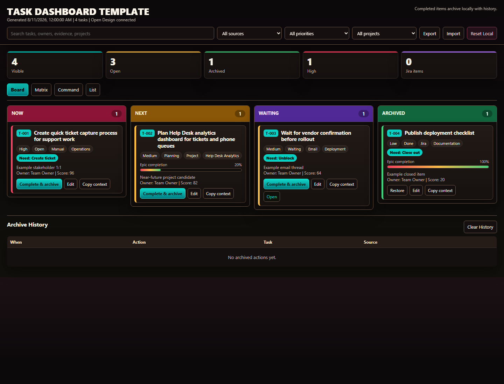

# WOS Task Dashboard Template

Optional static task dashboard template for `wos-task`, GitHub Pages, or any simple static host.

It includes four switchable views:

- Board: kanban-style work lanes
- Matrix: urgency and importance triage
- Command: dense operational dashboard
- List: sortable table with expandable task details

The app is intentionally backend-free. It stores user edits, archived items, notes, and view preferences in the browser with `localStorage`.

## Quick Start

1. Create a new GitHub repository for the dashboard.
2. Copy everything in this folder into that repository root.
3. Commit and push.
4. In GitHub, open `Settings` > `Pages`.
5. Set `Source` to `GitHub Actions`.

The included workflow at `.github/workflows/pages.yml` will publish the dashboard after each push to `main`.

If you do not want to use Actions, delete `.github/workflows/pages.yml`, set Pages to `Deploy from a branch`, and choose your default branch with `/root`.

## Local Preview

Open `index.html` directly in a browser.

No build step is required.



## Customize The Seed Data

Open `index.html` and find:

```html
<script id="seed" type="application/json">
```

Replace the JSON inside that script tag with your task data. Keep the same top-level shape:

```json
{
  "generatedAt": "2026-08-11T00:00:00-07:00",
  "timezone": "America/Los_Angeles",
  "sources": {},
  "tasks": []
}
```

See [docs/task-schema.md](docs/task-schema.md) for the task fields.

## Updating Data

For a manual workflow, edit the seed JSON and commit the updated `index.html`.

For an automated workflow, generate the same JSON shape from Jira, email, meeting notes, or another system, then replace the seed block before publishing.

Completed tasks should be archived by setting:

```json
"lane": "archive"
```

The dashboard also lets users archive tasks locally without changing the seed data.

## Notes

- This template does not include private Jira, Zoom, Outlook, or Fathom data.
- This template is optional. `wos-task` works without it.
- Browser edits are local to the device unless you wire in a backend or commit updated seed data.
- If you rename the dashboard or fork it for multiple teams, change the `storageKey` in `index.html` so local browser state does not overlap across deployments.
